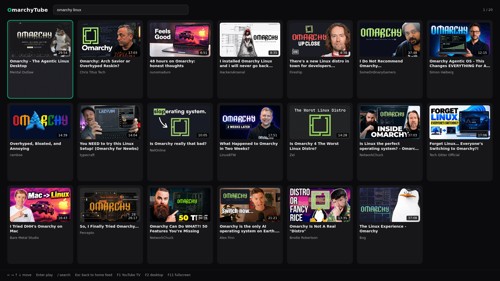

# 📺 OmarchyTube

> A dedicated, full-screen optimized YouTube client for **Omarchy** and **Hyprland**, inspired by YouTube ReVanced and SmartTube.

[🇸🇪 Svenska](README.sv.md)

Designed to deliver a clean, distraction-free YouTube experience in a standalone Wayland window without browser bloat. Features seamless **QR Code sign-in**, multi-layer ad blocking, native **SponsorBlock**, and 100% responsive window fitting.

---

## ✨ Features

- 🏠 **Own Browse Grid (the app's home)**
  - The app opens on its own grid: a keyboard-first wall of video cards built on YouTube's own data (InnerTube), not a wrapped webpage.
  - <kbd>/</kbd> searches, arrows move, <kbd>Enter</kbd> plays. Playback opens YouTube's **desktop watch page**, so ad blocking, SponsorBlock and the floating back button all still apply.
  - <kbd>F1</kbd> switches to YouTube's own view (TV or desktop, per mode); <kbd>Escape</kbd> or <kbd>Alt</kbd> + <kbd>Home</kbd> brings the grid back.



- 📱 **Seamless QR Code Sign-In (TV / Leanback Mode)**
  - No risk of Google's *"This browser or app may not be secure"* error.
  - Authenticates via Google's official **OAuth Device Flow**: simply scan the on-screen QR code with your phone camera or visit `youtube.com/activate`.
  - Securely persists your session, subscriptions, history, and playlists.

- 🎛️ **Dual View Modes (Toggle instantly with <kbd>F2</kbd>)**
  - **TV Mode (Default)**: YouTube Leanback interface optimized for full-bleed display, arrow-key navigation, remote controls, and QR authentication.
  - **Desktop Mode**: Standard YouTube desktop web interface for classic mouse and keyboard browsing.

- 🛡️ **Multi-Layer Ad Blocking**
  - **Network-Level**: Blocks requests to DoubleClick, Google AdServices, and YouTube ad tracking servers.
  - **Cosmetic Filtering**: Removes sponsored banners, promotional sidebars, and recommendation clutter.
  - **Video Skipping**: Instantly skips pre-roll and mid-roll video advertisements without countdown delays.

- ⚡ **Built-In SponsorBlock**
  - Automatically detects and skips sponsored segments, intros, outros, interaction reminders, and self-promotions using the official SponsorBlock API.
  - Segment highlight markers on the progress bar with an on-screen "Unskip" toast button.

- ↩️ **Floating Quick-Back Button & Video Exit**
  - Floating **`[ ← Back ]`** button smoothly appears in the top-left corner on mouse movement while watching videos.
  - Instantly exit playing videos and return to the grid via <kbd>Escape</kbd>, <kbd>Backspace</kbd>, or Mouse Back Button (Mouse 4).

- 🪟 **Tailored for Omarchy & Hyprland**
  - Native Wayland client (`--ozone-platform=wayland`).
  - Hardware-accelerated video decoding (VA-API).
  - Consistent window class (`StartupWMClass=OmarchyTube`) for easy Hyprland tiling, floating, and workspace rules.
  - Eliminates letterboxing, ensuring 100% full window canvas fill.

---

## 🚀 Getting Started

### Launching the App
- **Application Launcher (Walker / Rofi / Super key)**:
  Search for **OmarchyTube**.
- **Terminal**:
  ```bash
  OmarchyTube
  ```
- **Launch directly in Desktop Mode**:
  ```bash
  OmarchyTube --desktop
  ```

---

## ⌨️ Controls & Shortcuts

| Key / Mouse | Action |
|---|---|
| <kbd>F1</kbd> | **Switch between the app's own grid and YouTube's own view** (TV or desktop, per mode) |
| <kbd>/</kbd> | Focus the grid's search field |
| <kbd>Arrow Keys</kbd> / <kbd>PageUp</kbd> / <kbd>PageDown</kbd> / <kbd>Home</kbd> / <kbd>End</kbd> | Move around the grid |
| <kbd>Enter</kbd> | Play the selected card (opens YouTube's watch page) |
| <kbd>Escape</kbd> / <kbd>Backspace</kbd> / <kbd>q</kbd> | In a video: **exit it and return to the grid**. On the grid: **back to the home feed** |
| Click **`[ ← Back ]`** button | **Floating exit button shown on mouse movement** |
| Mouse Button 4 (Back) | Exit video / browser history back |
| <kbd>F2</kbd> | **Toggle between TV Mode and Desktop Mode** |
| <kbd>F11</kbd> | Toggle window fullscreen |
| <kbd>Arrow Keys</kbd> + <kbd>Enter</kbd> | Navigate and select items in TV Mode |
| <kbd>Space</kbd> / <kbd>k</kbd> | Play / Pause video |
| <kbd>Ctrl</kbd> + <kbd>R</kbd> / <kbd>F5</kbd> | Reload current page |
| <kbd>Alt</kbd> + <kbd>Home</kbd> | Return to the grid |

---

## 🔐 How Sign-In Works

1. Launch **OmarchyTube**. It opens on its own grid.
2. The grid works without an account: **search** is answered signed out, the
   **home feed** is not — YouTube answers it with nothing until you have an
   account (its own words are *"Your YouTube history is off"*). The grid says so
   and shows a search while you are signed out.
3. Press <kbd>F1</kbd> to open YouTube's own TV view, then use the arrow keys to
   navigate to the left sidebar and select **Sign in**.
4. A large **QR code** and an 8-character activation code appear on screen.
5. Scan the QR code with your phone camera (or open [youtube.com/activate](https://youtube.com/activate) in any browser).
6. Confirm access with your Google Account — the app connects immediately and keeps the session.
7. Press <kbd>Alt</kbd> + <kbd>Home</kbd> (or <kbd>F1</kbd>) to come back to the
   grid: the home feed is personal now, because the grid's requests run in the
   same session the sign-in just filled.

## 🛠️ Installation from Source

```bash
# Clone the repository
git clone https://github.com/alexwest1981/OmarchyTube.git
cd OmarchyTube

# Install dependencies
npm install

# Run application
npm start
```

### System Desktop Integration
To register the desktop application and CLI shortcut on Arch Linux / Omarchy:

```bash
# Symlink executable to user bin
ln -sf "$(pwd)/bin/omarchy-tube" ~/.local/bin/OmarchyTube

# Install desktop entry
mkdir -p ~/.local/share/applications
cp OmarchyTube.desktop ~/.local/share/applications/
update-desktop-database ~/.local/share/applications/
```

---

## 📜 License

MIT License. Designed with ❤️ for the Omarchy community.
